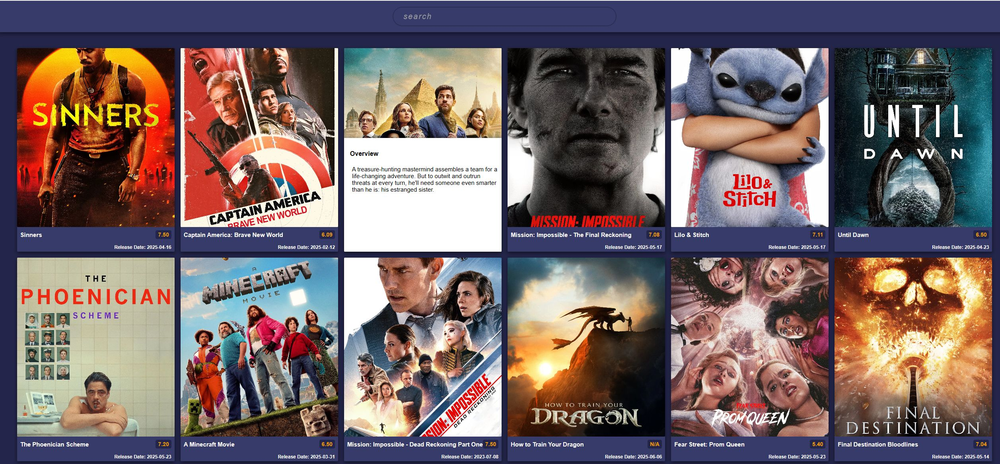
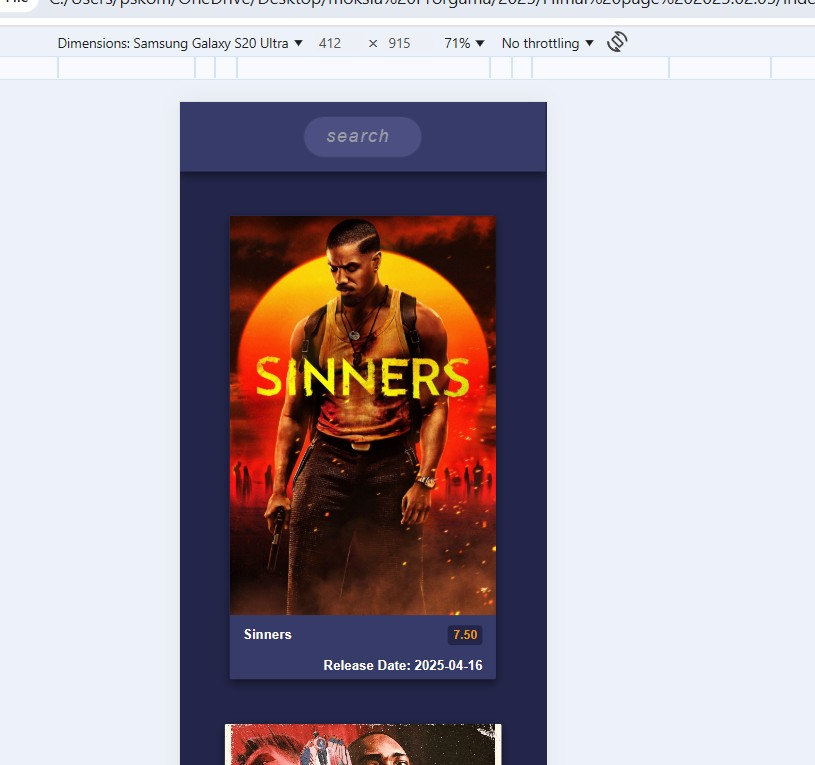
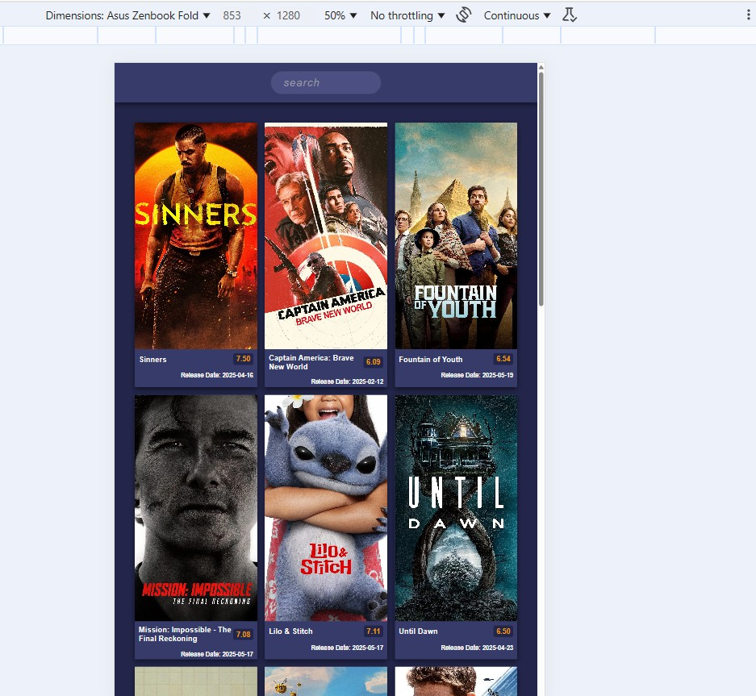

# Movie Finder App 🎬

This is a responsive movie browsing app built with **HTML**, **CSS**, and **JavaScript**. The app works smoothly on phones, tablets, and laptops.

It uses a public **movie API** to fetch and display:
- Movie titles
- Posters
- Overviews
- Ratings

You can explore trending movies and get basic details about each one with a simple, clean interface.

